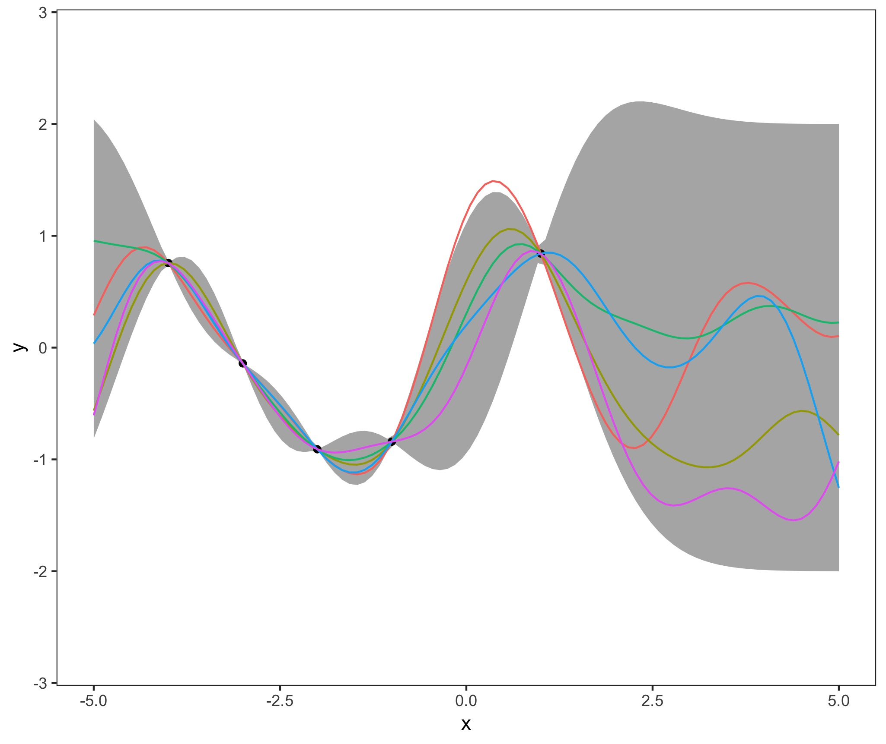

# GP Illustration based on Figure 2.5 Rasmussen & Williams (2006), 
# and Figure 15.3 in KPM (2012) in R

This code illustrates a one-dimensional Gaussian process regression with and without a conjugate-gradient optimizer.
The two code files generate a graphical illustration of the case with noiseless and noisy observations.


# Getting started
Install the relevant packages.

```r
# load packages
if (!require("pacman")) 
  install.packages("pacman"); library("pacman") 
p_load("MASS", 
       "ggplot2", 
       "reshape2")
```
# Simulate observed data
Simulated data from a sine function is used as a observed data:
```r
# generate observed x and y = f(x) values
x <- c(-4,-3, -2, -1 , 1)
noise <- 0.1
y = sin(x) + mvrnorm(1, 0 , noise)
# generate x values at which we need predictions
x.star <- seq(-5,5,len=100) 
```
# Compute Gaussian Kernel
First, a Gaussian kernel function generates the covariance matrix of the Gaussian process.
```r
getGaussian <- function(X1, X2 ,l=1, sigma.f = 1 ) {
  Zero <- matrix( rep( 0, len=length(X1)*length(X2)), 
                  nrow = length(X1))
  A <- Zero + X1
  B <- t(t(Zero)+X2)
  Sigma <- (sigma.f^2)*exp(-((A-B)^2)/(2*(l^2)))
  return(Sigma)
}
```
# Compute Covariance of Gaussian process and Posterior Distribution
The respective elements of the covariance matrix are computed. The noise term $\sigma_y^2 = noise" is only added in the case of noisy observations.
```r
# kernel elements
Ky <- getGaussian(x, x) + diag( nrow=length(x))*noise
K.star <- getGaussian(x, x.star) 
K.star.star <- getGaussian(x.star, x.star)
```

The posterior distribution of functions is computed using the covariance elements ...
```r
# posterior covariance and mean
postCov <- K.star.star - t(K.star)%*%solve(Ky)%*%K.star
mu.star <- t(K.star)%*%solve(Ky)%*%y
```
... and some functions are sampled from the posterior distribution to illustrate the posterior.

```r
sample <- replicate(5, mvrnorm(1, mu.star , postCov))%>%
  as.data.frame()
```
# Gradient-Based Optimization
In the case of an optimization, the hyperparameters in the Gaussian kernel as well as the noise parameter have to be optimized for by some gradient-based optimizer. I use a conjugate gradient optimizer.

First, the negative log-likelihood function is defined. It contains restrictions on the parameters, such that all of them cannot take on negative values. The input values of the optimizer function are the logs of the squared hyperparameters.

```r
likelihood <- function(hyper, X = x, Y = y){
  noise <-  (exp(hyper[1]))^0.5
  length <- (exp(hyper[2]))^0.5 
  sigma.f <-(exp(hyper[3]))^0.5
  N <- length(X)
  K <- getGaussian(X,X, l = length, sigma.f=sigma.f)
  Ky <- K + diag( nrow=ncol(K))*(noise^2)
  Kyi <- chol2inv(chol(Ky))
  loglik <- 0.5*t(Y)%*%Kyi%*%Y+ 0.5*log(det(Ky)) + N*0.5*log(2*pi)
  return(loglik)
}
```
Then the optim() function is used to find local minima.
```
hyper.opt <- optim( par =  c(1,1,1), 
                    fn =  likelihood, 
                    method = c("CG"))
```
Note that there is no strict rule for choosing the starting values of the optimizer.

The result of the optimizing process have to be transformed back from the log-input values.

```r
noise.opt <- exp(hyper.opt$par[1])^0.5
length.opt <- exp(hyper.opt$par[2])^0.5 
sigma.f.opt <- exp(hyper.opt$par[3])^0.5
```

# Results
The resulting plots clearly shows how the optimization process reduces the width of the confidence bands. This is intuitive as the optimization converges when the parametrization with the highest log-likelihood near the starting point is found.

The results for the noiseless case look like this:
 

In the noisy case, the Gaussian process does not have to interpolate the observed data points.
The results look like this:


# Acknowledgements and Sources

- The article by James Keirstead (2012) is a great starting point for GP regression in R: 
https://www.r-bloggers.com/gaussian-process-regression-with-r/

- Rasmussen \& William's "Gaussian Processes in Machine Learning" (2006) give a structured and extensive overview of Gaussian Processes

- Kevin P. Murphy provides code to examples from his book "Machine Learning - A Probabilistic Perspective" (2012) on his github page. The noisefree Gaussian process with simulated data can be found here: 
https://github.com/probml/pmtk3/blob/master/demos/gprDemoNoiseFree.m
