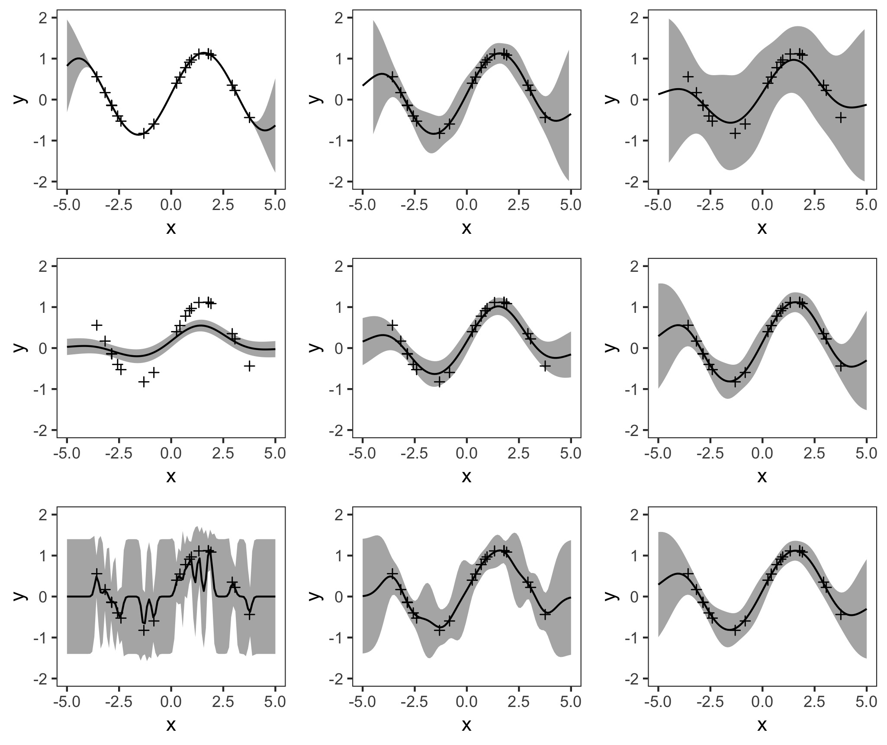

# Illustrating One-Dimensional Gaussian Processes

This code illustrates the influence of different hyperparameter parametrizations in a Gaussian kernel for a one-dimensional Gaussian process regression. The parametrizations change the data fit and complexity of the mean (and sampled) function(s) of the posterior distribution.
The Gaussian process is conditioned on twenty randomly drawn noisy observations.
The figures are based on Figure 2.5 in "Gaussian Processes in Machine Learning" by Rasmussen & Williams (2006) and Figure 15.3 in "Machine Learning - A Probabilistic Perspective" by Kevin P. Murphy (2012) in R.

# Output

The resulting plot of the Gaussian process conditioned on twenty noisy observations looks like this:

 


# Getting started
Install the relevant packages.
```r
if (!require("pacman")) 
  install.packages("pacman"); library("pacman") 
p_load("MASS", 
       "ggplot2", 
       "gridExtra")
```

# Simulate the Data
As in Rasmussen & Williams (2006) I use a noisy sine function. The observed values and the points at which y values should be predicted are generated like this:
```r
# observed values
x <- sample(-400:400, 20, replace=F)/100
# x values for prediction 
x.star <- seq(-5,5,len=100) 
# true noise
t.noise <- (0.1)^2
# y values
y = sin(x) + mvrnorm(1, 0 , t.noise) 
```
# Compute the Covariance Matrix
I also use a Gaussian kernel as proposed in Rasmussen & Williams (2006). Different kernels lead to different priors and therefore change the appearance of a Gaussian process. A Gaussian kernel is often used because of its similarity to the Gaussian density distribution and its relation to the Normal distribution. The function getGaussian generates a Gaussian kernel from two input vectors X1 and X2 and allows to set the length and width parameters l and sigma.f.
```r
getGaussian <- function(X1, X2 ,
                        l=1, sigma.f = 1 ) {
  Zero <- matrix( rep( 0, 
                       len=length(X1)*length(X2)), 
                  nrow = length(X1))
  A <- Zero + X1
  B <- t(t(Zero)+X2)
  Sigma <- (sigma.f^2)*exp(-((A-B)^2)/(2*(l^2)))
  return(Sigma)
}
```
# Compute Posterior and Plot Results
To compare different parametrizations, it is useful to code a function that computes and plots the Gaussian process. This will accelerate the plotting process later on. The function getGPPlot takes the observed x and y values as input (x,y), the prediction targets x.star, the Gaussian kernel hyperparameters l and sigma.f as well as a noise hyperparameter called noise.
It returns a plot of a one-dimensional Gaussian process with 95% confidence bands.
```r
getGpPlot <- function(x, x.star, y, noise , 
                      l , sigma.f ){
  K.star <- getGaussian(x, x.star, l=l , 
                        sigma.f= sigma.f) 
  K.star.star <- getGaussian(x.star, x.star, l=l , 
                             sigma.f= sigma.f) 
  Ky <- getGaussian(x, x, l=l , sigma.f= sigma.f) + 
    diag( nrow=length(x))*(noise^2)
  Kyi <- chol2inv(chol((Ky)))
  postCov <- K.star.star - 
    t(K.star)%*%Kyi%*%K.star
  mu.star <- t(K.star)%*%Kyi%*%y
  S2 <- diag(postCov)
  lowerbound <- mu.star +2*sqrt(S2)
  upperbound <- mu.star -2*sqrt(S2)
  gaussian.plot <- ggplot() + 
    geom_ribbon(x = x.star, 
                aes(ymin = lowerbound, 
                    ymax = upperbound), 
                fill = "grey70") +
    geom_point( data = NULL,aes( x = x, y = y), 
                shape=3) +
    geom_line(data = NULL, aes(x = x.star, 
                               y = mu.star)) +
    theme(legend.position="none") + 
    scale_x_continuous(name = "x", 
                       limits = c(-5,5)) +
    scale_y_continuous(name = "y", 
                       limits = c(-2,2)) +
    theme_bw() +
    theme(legend.position="none", 
          panel.grid.major = element_blank(), 
          panel.grid.minor = element_blank())
  return(gaussian.plot)
}
```

Then, follow this scheme to obtain all plots with the desired hyperparameters:
```r
figurea1 <- getGpPlot(x = x, x.star = x.star, 
                      y = y, noise = (0.025^2),  
                      l = 1, sigma.f = 1)
```
And arrange all plots in a grid:
```r
figure <- grid.arrange( figurea, figureb, 
                        figurec, nrow = 3)
ggsave("noisyhyper.jpg", plot = figure ) # save
```
As shown above, the result looks like this:

 

- The article by James Keirstead (2012) is a great starting point for GP regression in R: 
https://www.r-bloggers.com/gaussian-process-regression-with-r/ 

- This blog post by Katherine Bailey provides an overview and a bit more intuition about Gaussian processes: 
http://katbailey.github.io/post/gaussian-processes-for-dummies/

- Rasmussen \& William's "Gaussian Processes in Machine Learning" (2006) gives a structured and extensive overview of Gaussian Processes

- Kevin P. Murphy provides Matlab code to examples from his book "Machine Learning - A Probabilistic Perspective" (2012) on his github page. The noisefree Gaussian process with simulated data can be found here: 
https://github.com/probml/pmtk3/blob/master/demos/gprDemoNoiseFree.m
