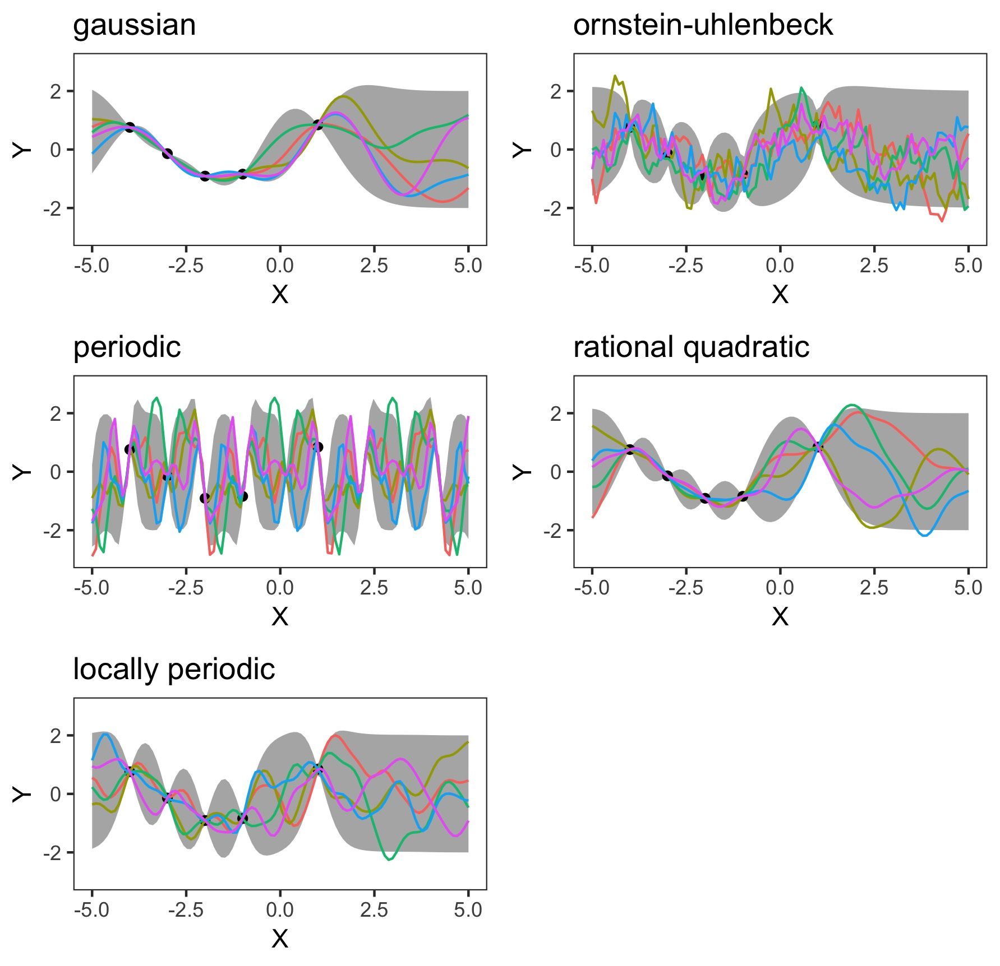

# Different Kernels in a One-Dimensional Gaussian Process
This code illustrate the effect that different kernels have on the appearance of a one-dimensional Gaussian process. Different kernels lead to distinctly different form of the functions, which are sampled from the posterior distribtion.
This is because kernels determine the prior over functions. Different kernels lead to different subsets of priors over functions, i.e. they only "allow" for certain shapes of functions. Determining the apppropriate kernel when conducting a Gaussian process is important for fitting an appropriate model. One criterion for cross-validation of different kernels is to optimize for the hyperparameters in the kernels and then compare and choose the model with the highest value of the log-likelihood. 

The code generates the following graph:



# Getting Started
Install packages:
```r
if (!require("pacman")) 
  install.packages("pacman"); library("pacman") 
p_load("MASS", 
       "ggplot2", 
       "reshape2",
       "gridExtra")
```

And generate the data, which consists of five noisy observations from a sine function:
```r
# observed values
x <- c(-4,-3, -2, -1 , 1)
y = sin(x)
# x values for prediction 
x.star <- seq(-5,5,len=100) 
```

# Defining the Kernel Functions
Most kernel functions take the distance between the points of a matrix or a vector as an input. Different kernels in a Gaussian process generate different priors over functions. This is the reason why results of a Gaussian process regression may differ when using different kernels. The set of possible functions changes when different kernels are used.
To illustrate how Gaussian processes change when different kernels are used, I use five different kernels:

1. Gaussian kernel
```r
# Gaussian kernel
gaussKernel <- function(X1, X2 ,
                        l=1, sigma.f = 1 ) {
  Zero <- matrix( rep( 0, 
                       len=length(X1)*length(X2)), 
                  nrow = length(X1))
  A <- Zero + X1
  B <- t(t(Zero)+X2)
  Sigma <- (sigma.f^2)*exp(-((A-B)^2)/(2*(l^2)))
  return(Sigma)
}
```

2. Ornstein-Uhlenbeck kernel
```r
# Ornstein-Uhlenbeck kernel
ouKernel <- function(X1, X2) {
  Zero <- matrix( rep( 0, 
                       len=length(X1)*length(X2)), 
                  nrow = length(X1))
  A <- Zero + X1
  B <- t(t(Zero)+X2)
  Sigma <- exp(-(abs(A-B))/(1))
  return(Sigma)
}
```

3. Periodic kernel
```r
# Periodic kernel
periodicKernel <- function(X1, X2) {
  Zero <- matrix( rep( 0, 
                       len=length(X1)*length(X2)), 
                  nrow = length(X1))
  A <- Zero + X1
  B <- t(t(Zero)+X2)
  Sigma <- exp(-2*((sin(A-B))^2)/(0.3^2))
  return(Sigma)
}
```

4. Rational quadratic kernel
```r
# Rational quadratic kernel
ratKernel <- function(X1, X2) {
  Zero <- matrix( rep( 0, 
                       len=length(X1)*length(X2)), 
                  nrow = length(X1))
  A <- Zero + X1
  B <- t(t(Zero)+X2)
  Sigma <- (1+((A-B)^2)/(5*1^2))^(-5)
  return(Sigma)
}
```
5. Locally periodic kernel
```r
locKernel <- function(X1, X2 ) {
  Zero <- matrix( rep( 0, 
                       len=length(X1)*length(X2)), 
                  nrow = length(X1))
  A <- Zero + X1
  B <- t(t(Zero)+X2)
  Sigma1 <- 1*exp(-((A-B)^2)/(2*(1)))
  Sigma2 <- exp(-2*((sin(A-B))^2)/(1))
  Sigma <- Sigma1*Sigma2
  return(Sigma)
}
```

# Computing the Covariance and Posterior of the GP
The function myplot() computes the covaraince and posterior of the Gaussian process and returns a plot of a one-dimensional Gaussian process with 95% confidence bands, as well as some sample functions from the posterior.

First, it chooses the kernel entered by the user.
```r
names <- c("gaussian", "ornstein-uhlenbeck", 
             "periodic","rational quadratic", 
             "locally periodic")
var <- which(names %in% mykernel)
kernel <- function(var = var, X1, X2){
    switch(var, 
           return(gaussKernel(X1, X2)),
           return(ouKernel(X1, X2)),
           return(periodicKernel(X1, X2)),
           return(ratKernel(X1, X2)),
           return(locKernel(X1, X2)))
  } 
```

Then it computes the covarinace elements ...
```r
K <- kernel(var, X, X)
K.star <- kernel(var, X, X.star) 
K.star.star <- kernel(var, X.star, X.star) 
```
... mean and variance of the posterior distribution ...
```r
postCov <- K.star.star - 
      t(K.star)%*%solve(K)%*%K.star
mu.star <- t(K.star)%*%solve(K)%*%y
```
... samples from the posterior...
```r
sample <- replicate(5, mvrnorm(1, 
                                   mu.star ,
                                   postCov))%>%
      as.data.frame()
values <- cbind(x = x.star, sample)
values <- melt(values,id="x")
```
... confidence bands...
```r
S2 <- diag(postCov)
lowerbound <- mu.star +2*sqrt(S2)
upperbound <- mu.star -2*sqrt(S2)
```
And ultimately plots the Gaussian process with ggplot().

# Obtaining the Results
To obtain the results, call the myplot() function with the desired kernels ...
```r
gaussian <- myplot("gaussian")
ornstine <- myplot("ornstein-uhlenbeck")
periodic <- myplot("periodic")
rational <- myplot("rational quadratic")
locped <- myplot("locally periodic")
 ```
... and arrange them in a grid
```r
figure <- grid.arrange(gaussian, ornstine, 
                       periodic, rational, 
                       locped , nrow = 3)
figure
ggsave("gp_kernels.jpg", plot = figure ) # save
```

# Acknowledgements and Starting Tips for Gaussian Processes
- This lecture by Richard Turner from the University of Cambridge shows different priors, by conditioning only on one data point. It also gives an intuition of how x-values in Gaussian processes can be seen as infinitely many jointly normally distributed variables:
https://www.youtube.com/watch?v=92-98SYOdlY&t=4886s

- Rasmussen & William's "Gaussian Processes in Machine Learning" (2006) gives a structured and extensive overview of Gaussian Processes and is standard literature for Gaussian Processes

- Kevin P. Murphy provides code to examples from his book "Machine Learning - A Probabilistic Perspective" (2012) on his github page: https://github.com/probml/pmtk3/blob/master/demos
