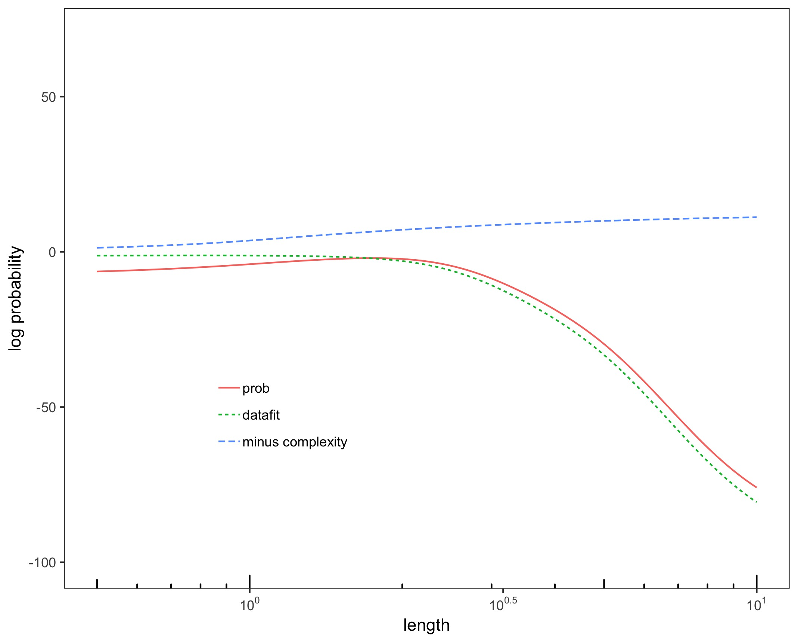
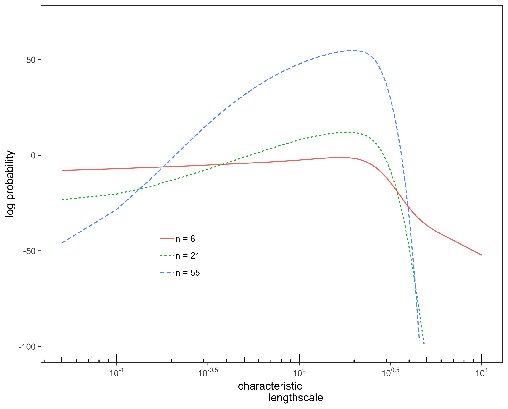

# Log-Likelihood of a Gaussian Process

This code replicates Figure 5.3 in "Gaussian Processes in Machine Learning" by Rasmussen & Williams in R. It illustrates how the different terms of the log-likelihood develop when a kernel hyperparameter (the length scale of a Gaussian kernel) is changed. It also illustrates that the log-likelihood has more distinct peaks (when plotted over one variable axis) when sample sizes grow larger.

# Output

The code produces a plot for the different elements of the log-likelihood over varying length scales ...
 

... and the log-likelihood over the length scales with different sample sizes ...
 

# Getting Started
First, load the necessary packages
```r
# load packages
if (!require("pacman")) 
  install.packages("pacman"); library("pacman") 
p_load("MASS", 
       "ggplot2", 
       "scales",
       "reshape2")
```
# Generate Data
Generate Data point sampled from a noisy sine function
```r
# generate sample data from a sine function
# with normally distributed noise
x <- sample(-400:400, 7, replace=F)/100
noise <- (0.1)^2
y = sin(x) + mvrnorm(1, 0 , noise) 
```
# Define the Kernel Function
Define the kernel function for the squared exponential kernel.
```r
getGaussian <- function(X1, X2 = NULL ,l=1, 
                        sigma.f=1 ) {
  dist <- switch( is.null(X2) + 1, 
                  as.matrix(pdist(X1, X2)),
                  as.matrix(dist(X1)))
  #compute kernel
  Sigma <- (sigma.f^2)*exp(-0.5*(dist^2/(l^2)))
  return(Sigma)
}
```
# Define the Log-Likelihood
Define the log-likelihood as given in Rasmussen & Williams 2006.
Either with the respective elements as output...
```r
likelihood <- function(length, noise=0.1){
  Ky <- getGaussian(x, l=length) + 
    diag(nrow=length(x))*(noise^2)
  Kyi <- chol2inv(chol(Ky))
  prob <- -0.5*y%*%Kyi%*%y - 
    0.5*log(det(Ky)) - 
    0.5*length(x)*log(2*pi)
  datafit <- -0.5*y%*%Kyi%*%y
  complex <- - 0.5*log(det(Ky))
  return(rbind(length, prob, datafit, complex))
}
```
... or only the probability
```r
prob <- function(length, noise=0.1){
  Ky <- getGaussian(x, l=length) + 
    diag(nrow=length(x))*(noise^2)
  Kyi <- chol2inv(chol(Ky))
  prob <- -0.5*y%*%Kyi%*%y - 
    0.5*log(det(Ky)) - 
    0.5*length(x)*log(2*pi)
  return(prob)
}
```
Generate some different sample sizes for figure 5.3b
```r
samp.size <- as.data.frame(t(rbind(
  x = sy, s =mydata.small, 
  m=mydata.med, l=mydata.large)))
colnames(samp.size)<- c("samp", "n = 8", 
                     "n = 21", "n = 55")
samp.size <- melt(samp.size,id="samp")
```

Finally, plot the results:
 


