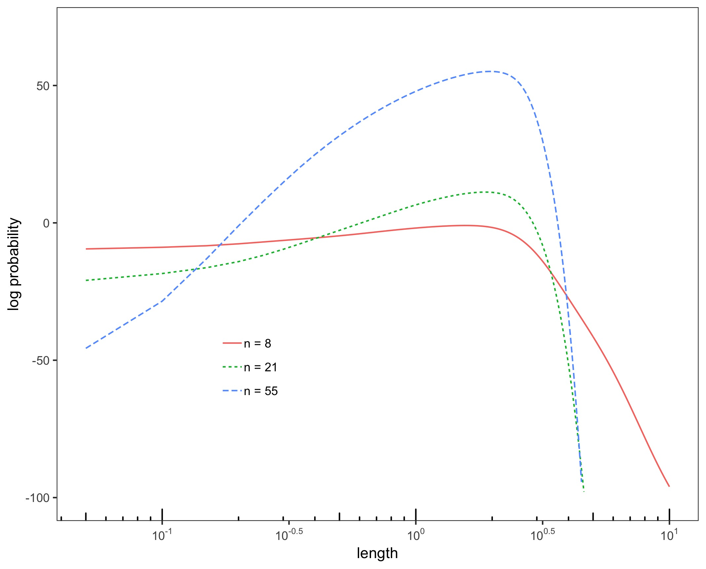

# Log-Likelihood of a Gaussian Process

This code replicates Figure 5.3 in "Gaussian Processes in Machine Learning" by Rasmussen & Williams in R. It illustrates how the different terms of the log-likelihood develop when a kernel hyperparameter (the length scale of a Gaussian kernel) is changed. It also illustrates that the log-likelihood has more distinct peaks (when plotted over one variable axis) when sample sizes grow larger.

# Output

The code produces a plot for the different elements of the log-likelihood over varying length scales ...
 

... and the log-likelihood over the length scales with different sample sizes ...
 
