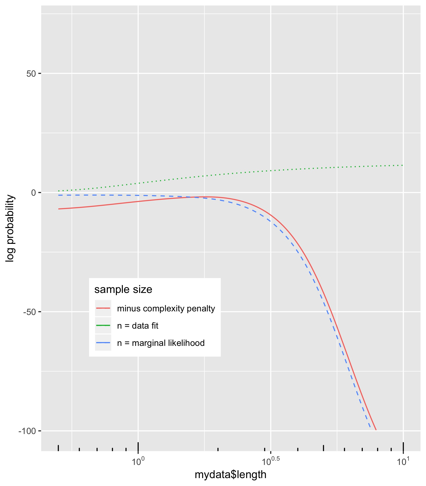
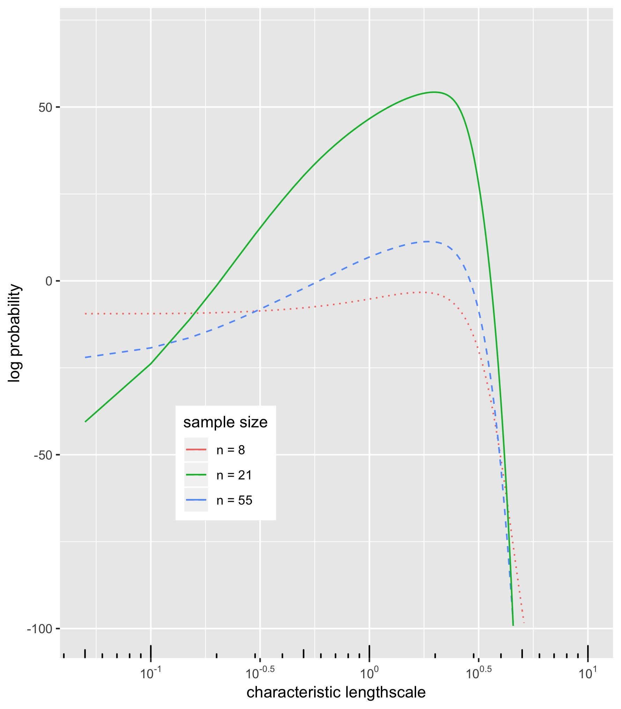
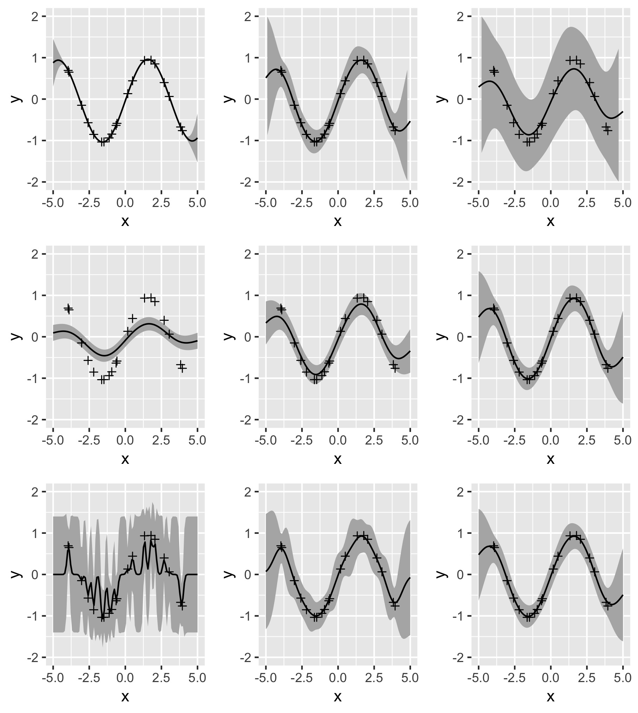

# MachineLearning
Some Illustration of Gaussian Processes with simulated data.

# HparamInLikelihood
Replicates Figure 5.3a and Figure 5.3b from Rasmussen & Williams (2006) in R.
\

# InfluenceOfHyperparameters
Illustrating the effect of different choices of hyperparameters in a Gaussian Process with an SE Kernel. The figure is an extension of figure 15.3 in KPM (2012) and implemented in R based on the Matlab Code gprDemoChangeHparams written by Carl Rasmussen.
\

# Some different kernel functions
Some different kernels in R.
\

