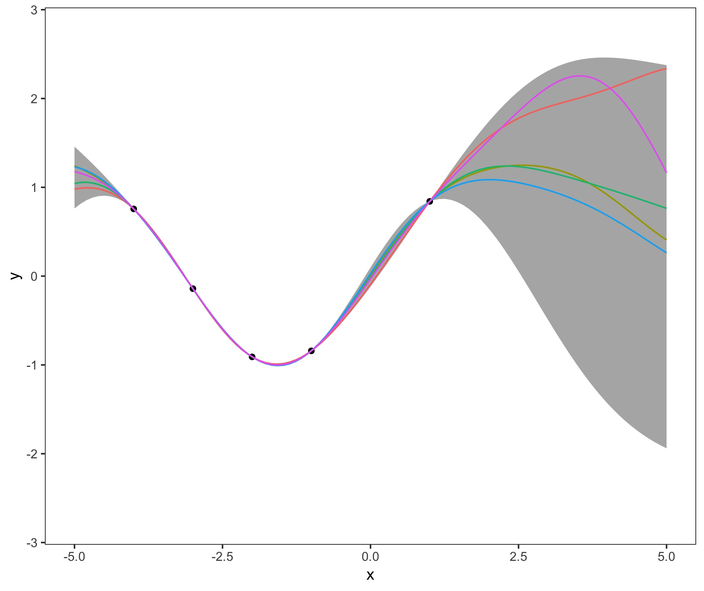
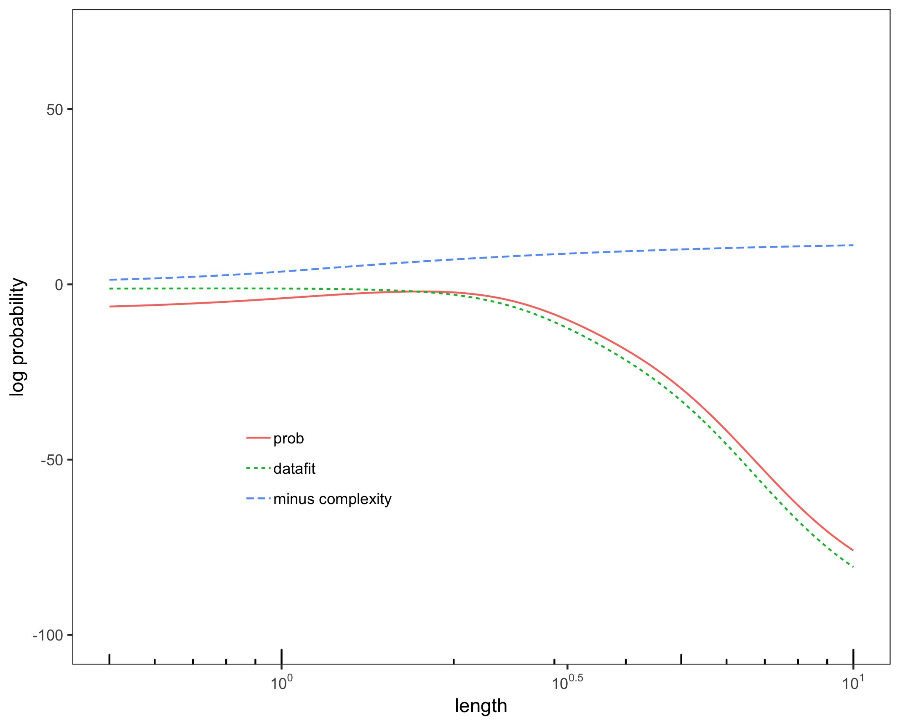

# Gaussian Processes
Some Illustration of Gaussian Processes with simulated data. The project is part of a seminar paper in the course "Machine Learning - A Probabilistic Approach" at Humboldt University

See individual folders for code descriptions and useful sources.

Author: Clara Hoffmann

# GP_1D

One-dimensional Gaussian process with noiseless and noisy samples of a sine function and conjugate gradient optimization. partly based on Figure 2.5 in "Gaussian Processes for Machine Learning" by Rasmussen & Williams (2006) and Figure 15.3 in "Machine Learning - A Probabilistic Perspective" by Kevin P. Murphy (2012)

  

# GP_Hyperparam

One-dimensional Gaussian process with squared exponential kernel and varying hyperparameters,extended representation of figure 5.5 from Rasmussen \& Williams "Gaussian Processes for Machine Learning"

 

# GP_kernels

One-dimensional Gaussian process with different kernels.

# GP_Likelihood

Development of the log-likelihood of a one-dimensional Gaussian process with varying length scales and hyperparameters (replicates Figure 5.3 from Rasmussen \& Williams "Gaussian Processes for Machine Learning")

 

