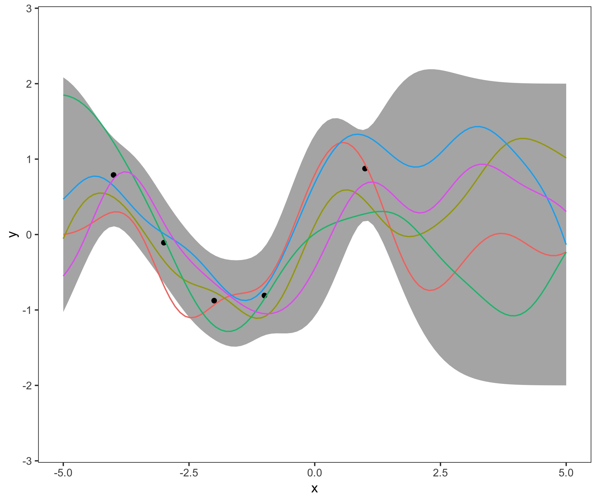
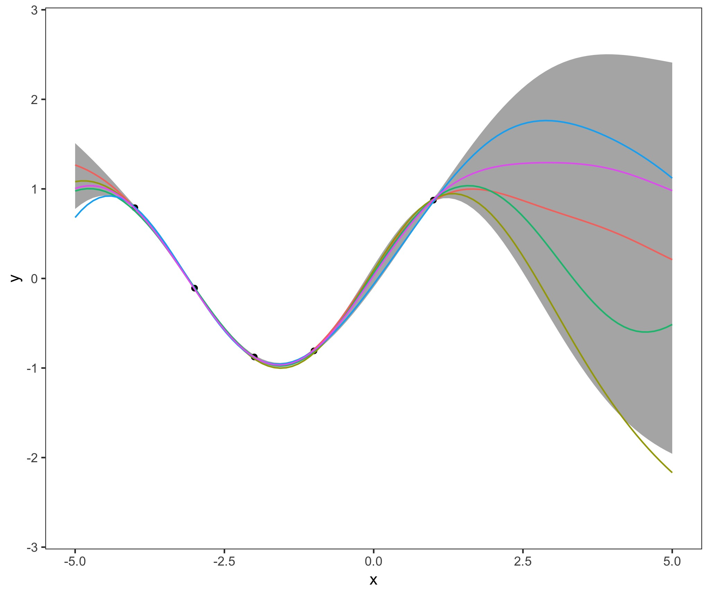

# MachineLearning
Some Illustration of Gaussian Processes with simulated data.
Content of a Seminar Paper in the course "Machine Learning - A Probabilistic Approach" at Humboldt University

Author: Clara Hoffmann

# Contents
# GP_1D

One-dimensional Gaussian process with noiseless and noisy samples of a sine function and conjugate gradient optimization

  

